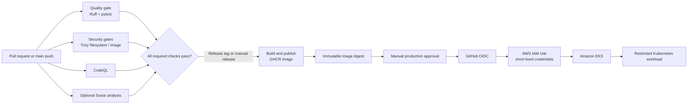

# DevSecOps CI/CD Platform


**DevSecOps CI/CD Platform** is a portfolio-ready reference implementation that demonstrates how a small API can be delivered through a security-gated pipeline. It combines automated quality checks, static analysis, filesystem, secret, infrastructure, and container scans, immutable image publication, Kubernetes workload hardening, and an AWS OIDC/Terraform foundation—without committing credentials or creating cloud resources by default.

> **Design goal:** A release must be tested, scanned, traceable to an immutable image, and explicitly approved before it can reach a production Kubernetes cluster.

## Architecture



The pipeline uses minimum GitHub token permissions, a manually dispatched production deployment, a protected `production` environment, and an OIDC role restricted to an exact repository environment subject. GitHub’s OIDC guidance recommends conditions that limit which workflows can assume a cloud role; this repository applies that recommendation in Terraform. [GitHub OIDC guidance](https://docs.github.com/actions/deployment/security-hardening-your-deployments/configuring-openid-connect-in-amazon-web-services)

| Layer | Included controls |
| --- | --- |
| **Application quality** | FastAPI operational endpoints, pytest contract tests, Ruff linting, and pinned Python runtime. |
| **Source and IaC security** | CodeQL, Trivy vulnerability/secret/misconfiguration scans, and a weekly scheduled scan. |
| **Container supply chain** | Non-root image, no package cache, health check, immutable release tags, and digest-based deployment. |
| **Kubernetes hardening** | Two replicas, resource limits, health probes, read-only root filesystem, dropped capabilities, restricted seccomp, network policy, PDB, HPA, and namespace-scoped RBAC. |
| **Cloud access** | Terraform-managed ECR, GitHub OIDC, short-lived credentials, explicit repository/environment trust condition, and no static AWS access key. |

## Quick Start

The sample API provides `/healthz`, `/readyz`, and `/version` endpoints. These responses include only operational metadata and do not expose configuration secrets.

```bash
git clone https://github.com/AYANOKOJI-71/devsecops-cicd-platform.git
cd devsecops-cicd-platform
cp .env.example .env
python3 -m venv .venv
. .venv/bin/activate
python -m pip install --upgrade pip
python -m pip install -e '.[dev]'
ruff check .
pytest
APP_ENVIRONMENT=local APP_VERSION=0.1.0-local uvicorn app.main:app --reload --port 8080
```

```bash
curl http://localhost:8080/healthz
curl http://localhost:8080/readyz
curl http://localhost:8080/version
```

For container testing, build the image and invoke its health endpoint after starting it.

```bash
docker build -t devsecops-cicd-platform:local .
docker run --rm -p 8080:8080 \
  -e APP_ENVIRONMENT=container \
  -e APP_VERSION=local \
  devsecops-cicd-platform:local
```

## CI/CD Workflow

| Workflow | Trigger | Purpose | Security behavior |
| --- | --- | --- | --- |
| `Quality Gate` | Pull request, push, manual | Runs Ruff and pytest. | Read-only repository token. |
| `Security Gates` | Pull request, push, weekly, manual | Scans source, secrets, IaC, and a locally built container with Trivy. Optionally runs Sonar analysis. | The Trivy image is pinned by digest. Sonar is skipped—not silently passed—until its token is configured. |
| `CodeQL` | Pull request, push, weekly, manual | Performs Python code scanning. | Only the security-events permission is added. |
| `Release Container` | Version tag or manual | Publishes a release image to GitHub Container Registry. | Runs only with package write permission. |
| `Deploy to Production EKS` | Manual only | Deploys a validated image digest to Kubernetes. | Requires the protected `production` environment, OIDC, exact-digest validation, and rollout verification. |

External actions are pinned to immutable commit revisions. The workflows intentionally avoid `pull_request_target`, privileged pull-request checkouts, plaintext secrets, and cloud credentials stored in GitHub. GitHub recommends minimum permissions and warns that privileged pull-request triggers can expose secrets or write access. [GitHub workflow hardening guidance](https://docs.github.com/actions/security-for-github-actions/security-guides/security-hardening-for-github-actions)

## Configure Optional Integrations

The default project is safe to inspect and run locally. The following configuration is required only to activate optional external services.

| Integration | GitHub configuration | Why it is needed |
| --- | --- | --- |
| **SonarQube / SonarCloud** | `SONAR_TOKEN` secret and, for self-hosted SonarQube, `SONAR_HOST_URL` variable. | Enables maintainability and quality-rule analysis. |
| **GitHub Container Registry** | No extra secret; the release workflow uses the workflow token. | Publishes tagged release images. Set the package visibility intentionally after the first release. |
| **AWS deployment** | Create the Terraform resources, then configure a protected `production` environment with `AWS_REGION`, `AWS_ROLE_TO_ASSUME`, and `EKS_CLUSTER_NAME` variables. | Lets the manual workflow authenticate via short-lived OIDC credentials and deploy to a chosen EKS cluster. |

Do not put account IDs, role ARNs, API tokens, kubeconfigs, or Terraform state in source control. Configure the production environment to require a reviewer and restrict deployments to `main`. The repository contains a Terraform example for the GitHub OIDC trust policy and uses no live cloud credentials. See [`terraform/README.md`](terraform/README.md) for the safe setup sequence.

## Kubernetes and Infrastructure

The Kubernetes base configuration is in [`k8s/base`](k8s/base) and the production overlay is in [`k8s/overlays/prod`](k8s/overlays/prod). The deployment workflow replaces `__IMAGE_TAG__` with a validated image digest before applying the rendered manifests, keeping the release traceable to the exact scanned image.

The Terraform module in [`terraform`](terraform) provisions an immutable, scan-on-push ECR repository and an optional GitHub OIDC provider plus least-privilege deployment role. It deliberately targets a **pre-existing EKS cluster** rather than attempting to create a costly cluster automatically. The module is therefore suitable as a secure delivery foundation and a clear extension point for a dedicated EKS/VPC module.

```bash
cd terraform
cp terraform.tfvars.example terraform.tfvars
terraform init
terraform fmt -check -recursive
terraform validate
terraform plan
```

## Repository Layout

```text
app/                   Minimal FastAPI workload and operational endpoints
tests/                 API contract tests
.github/workflows/     Quality, security, CodeQL, release, and gated deploy pipelines
k8s/                   Kustomize base and production overlay with workload hardening
terraform/             ECR, GitHub OIDC, IAM role, and optional EKS access entry
docs/                  Architecture research and design decisions
```

## Validation

The planned local validation sequence checks the unit tests, linting, Docker image behavior, rendered Kubernetes manifests, Terraform formatting and validation, GitHub Action YAML syntax, and the absence of tracked secrets. The GitHub workflows provide the equivalent automated checks after publishing.

```bash
make install
make lint
make test
make validate
```

## Limitations and Next Steps

This is a secure **reference platform**, not a live cloud deployment. A real production rollout still requires an AWS account, an EKS cluster, Sonar configuration if desired, protected GitHub environments, and appropriate organizational review. Future improvements can add signed images with Sigstore, SBOM generation and attestation, a dedicated EKS/VPC Terraform module, policy-as-code admission control, and centralized observability.

## Author

Built by **Sarowar Hossain Rony** as a portfolio project demonstrating DevSecOps delivery practices across GitHub Actions, Docker, Kubernetes, Terraform, SonarQube, Trivy, and AWS.

## References

1. [GitHub: Configuring OpenID Connect in AWS](https://docs.github.com/actions/deployment/security-hardening-your-deployments/configuring-openid-connect-in-amazon-web-services)
2. [GitHub: Security hardening for GitHub Actions](https://docs.github.com/actions/security-for-github-actions/security-guides/security-hardening-for-github-actions)
3. [AWS IAM: Create an OpenID Connect identity provider](https://docs.aws.amazon.com/IAM/latest/UserGuide/id_roles_providers_create_oidc.html)
4. [Aqua: Trivy supply-chain incident update](https://www.aquasec.com/blog/trivy-supply-chain-attack-what-you-need-to-know/)
